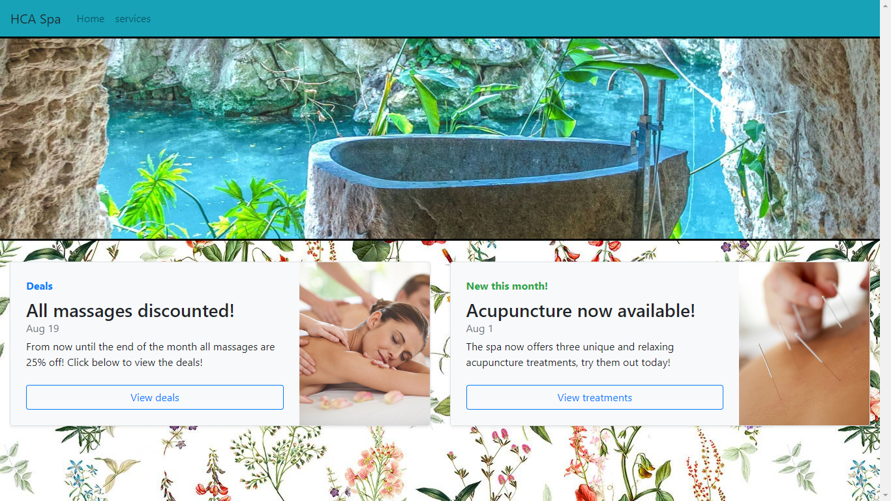

# RelaxingSPA

## About

The purpose of this project is to demonstrate the functionality of a single page application. The app will be done under the theme of a Spa, and it will display a list of services offered by the spa.

## Tech

The webpage will be written in HTML, CSS, and JavaScript. Additionally, the page will utilize a server file to dynamically pull data from a local JSON file.

## How To

To launch the server, navigate to the parent folder RelaxingSPA in your file directory. Drag that folder into your command line and change to that directory. Once there, perform a 'node server.js' to initialize the webserver. Then, enter 'localhost:8081/' in your browser's address bar.

## Website

Format: ![Website]